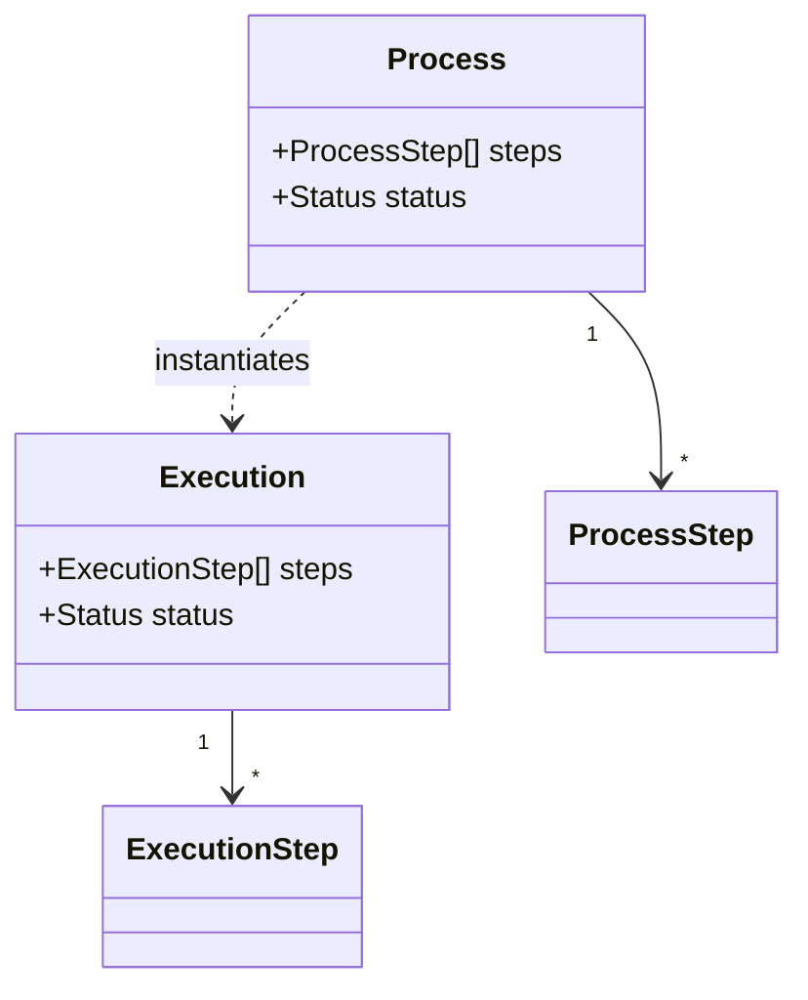
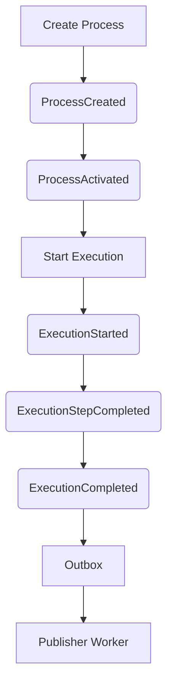

<div align="center">

# Backend Tickets

**Ticket workflow automation backend** built with Domain-Driven Design, Clean Architecture, and Event-Driven patterns.

[](https://www.typescriptlang.org/)
[](https://nodejs.org/)
[](https://www.postgresql.org/)
[](https://www.prisma.io/)
[](#license)
[](https://codecov.io/gh/hxcCoder/saas-ticket-backend)
</div>

---

## Table of Contents

- [Overview](#overview)
- [Features](#features)
- [Tech Stack](#tech-stack)
- [Architecture](#architecture)
- [Domain Model](#domain-model)
- [Event Flow](#event-flow)
- [API Reference](#api-reference)
- [Database Schema](#database-schema)
- [Getting Started](#getting-started)
- [Testing](#testing)
- [Roadmap](#roadmap)
- [Learning Goals](#learning-goals)
- [License](#license)

---

## Overview
Backend Tickets is a SaaS-oriented backend that lets an organization **define, activate, run, and monitor business processes** — think invoice approvals, onboarding checklists, or any multi-step internal workflow — without sacrificing maintainability as the system grows.

Under the hood, every state change is captured as a **Domain Event** and persisted transactionally through the **Outbox Pattern**, so the core workflow engine stays fully decoupled from whatever consumes those events downstream (notifications, analytics, third-party integrations, etc.).

The codebase is intentionally built as a reference implementation of Clean Architecture + DDD in TypeScript — strict layering, explicit domain rules, and transactional consistency from day one.

## Features

| Category | What it does |
|---|---|
| **Process Management** | Create processes, activate workflows, define ordered steps, enforce domain rules |
| **Execution Engine** | Start executions, track status, complete steps, auto-emit domain events |
| **Event-Driven Core** | Domain Events · Audit Logging · Outbox Pattern · Event Publishing Worker |
| **SaaS Capabilities** | Multi-organization support, subscription validation, plan restrictions, active process limits |
| **Security** | JWT auth middleware, request validation with Zod, structured domain error handling |

## Tech Stack

| Layer | Technology |
|---|---|
| Runtime / Framework | Node.js (ESM Node16 resolution), Express, TypeScript |
| Persistence | PostgreSQL, Prisma ORM |
| Architecture | InversifyJS (DI), AsyncLocalStorage, Unit of Work |
| Validation | Zod |
| Testing | Jest |
| Logging | Winston, Morgan |

## Architecture

This proyect follows a strict layered architecture inspired by Clean Architecture and DDD — dependencies always point inward, toward the domain.

```text
src
├── domain            # Entities, domain events, business rules
├── application       # Use cases, ports (interfaces)
├── infrastructure    # Prisma, repositories, services, DI container
└── interfaces
    └── http          # Controllers, routes, middleware
```

**Patterns in play:** Clean Architecture · Domain-Driven Design · Repository Pattern · Dependency Injection · Unit of Work · Outbox Pattern · Event-Driven Architecture

## Domain Model



| Aggregate | Emits |
|---|---|
| **Process** | `process.created` · `process.activated` · `process.archived` |
| **Execution** | `execution.started` · `execution.step.completed` · `execution.completed` |

## Event Flow



Every domain event lands in the **Outbox** within the same transaction as the state change, then gets relayed by the **Publisher Worker** — guaranteeing at-least-once delivery without ever risking an inconsistent state.

## API Reference

| Method | Endpoint | Purpose |
|---|---|---|
| `POST` | `/api/organizations` | Create an organization |
| `POST` | `/api/processes` | Create and activate a process |
| `POST` | `/api/processes/start-execution` | Start a new execution of a process |

<details>
<summary><strong>POST /api/organizations</strong></summary>

```json
{
  "name": "My Company",
  "status": "ACTIVE",
  "plan": "PRO"
}
```
</details>

<details>
<summary><strong>POST /api/processes</strong></summary>

```json
{
  "organizationId": "uuid",
  "name": "Invoice Approval",
  "steps": [
    { "id": "uuid", "name": "Review", "order": 0 }
  ]
}
```
</details>

<details>
<summary><strong>POST /api/processes/start-execution</strong></summary>

```json
{
  "processId": "uuid",
  "executionId": "uuid"
}
```
</details>

## Database Schema

Core entities managed via Prisma:

`Organization` · `Subscription` · `Plan` · `Process` · `ProcessStep` · `Execution` · `ExecutionStep` · `AuditLog` · `Outbox`

## Getting Started

```bash
# 1. Clone the repo
git clone https://github.com/your-user/saas-ticket-backend.git
cd saas-ticket-backend

# 2. Install dependencies
npm install

# 3. Configure environment
cp .env.example .env
# then set DATABASE_URL and JWT_SECRET

# 4. Run migrations
npx prisma migrate dev

# 5. Generate the Prisma client
npx prisma generate

# 6. Start the dev server
npm run dev
```

The API will be available at `http://localhost:3000` (or whichever `PORT` you configure).

## Testing

```bash
# Unit tests
npm test

# Integration tests
npm run test:integration
```

## Learning Goals

This project was built to practice and demonstrate:

Advanced TypeScript · Clean Architecture · Domain-Driven Design · Event-Driven Systems · Backend Design · Transaction Management · Repository Pattern · Dependency Injection

## License

Distributed under the **MIT License**.
